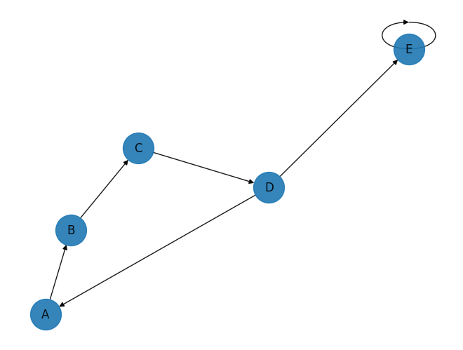
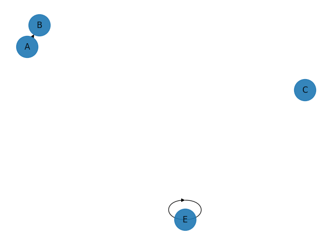

# Directed Graph

## 1 Testing

### 1.1 Commands

Test Directed Graph using below commands:

```sh
cd 01_data_structures/07_graphs/02_directed
python main.py
```

### 1.2 Output

#### 1.2.1 Create

```log
Initialize empty Directed Graph:
Graph is empty!

Add below 5 vertices to graph:
['A', 'B', 'C', 'D', 'E']
Adding vertex 'A' into graph.
Adding vertex 'B' into graph.
Adding vertex 'C' into graph.
Adding vertex 'D' into graph.
Adding vertex 'E' into graph.

Adjacency list:
Vertex(value='A') => []
Vertex(value='B') => []
Vertex(value='C') => []
Vertex(value='D') => []
Vertex(value='E') => []

Plot graph with only vertices.
```


#### 1.2.2 Update

```log
Add 9 valid edges to graph:
Adding edge from Vertex(value='A') to Vertex(value='B').
Adding edge from Vertex(value='B') to Vertex(value='C').
Adding edge from Vertex(value='C') to Vertex(value='D').
Adding edge from Vertex(value='D') to Vertex(value='A').
Adding edge from Vertex(value='D') to Vertex(value='E').
Adding edge from Vertex(value='E') to Vertex(value='E').
Adding edge from Vertex(value='D') to Vertex(value='Y').
ERROR: Not found: 'Vertex(value='Y')'
Adding edge from Vertex(value='Y') to Vertex(value='D').
ERROR: Not found: 'Vertex(value='Y')'
Adding edge from Vertex(value='X') to Vertex(value='Y').
ERROR: Not found: 'Vertex(value='X')'

Adjacency list:
Vertex(value='A') => [Vertex(value='B')]
Vertex(value='B') => [Vertex(value='C')]
Vertex(value='C') => [Vertex(value='D')]
Vertex(value='D') => [Vertex(value='A'), Vertex(value='E')]
Vertex(value='E') => [Vertex(value='E')]

Plot graph after adding edges.
```



#### 1.2.3 Delete

```log
Delete 2 vertices from graph:
Delete vertex: Vertex(value='D')
Delete vertex: Vertex(value='X')
ERROR: Not found: 'Vertex(value='X')'

Adjacency list:
Vertex(value='A') => [Vertex(value='B')]
Vertex(value='B') => [Vertex(value='C')]
Vertex(value='C') => []
Vertex(value='E') => [Vertex(value='E')]

Plot graph after deleting vertices.
```


```log
Delete 5 edges:
Deleting edge from Vertex(value='B') to Vertex(value='C').
Deleting edge from Vertex(value='A') to Vertex(value='C').
Deleting edge from Vertex(value='E') to Vertex(value='X').
ERROR: Not found: 'Vertex(value='X')'
Deleting edge from Vertex(value='X') to Vertex(value='A').
ERROR: Not found: 'Vertex(value='X')'
Deleting edge from Vertex(value='X') to Vertex(value='Y').
ERROR: Not found: 'Vertex(value='X')'

Adjacency list:
Vertex(value='A') => [Vertex(value='B')]
Vertex(value='B') => []
Vertex(value='C') => []
Vertex(value='E') => [Vertex(value='E')]

Plot graph after deleting edges.
```


